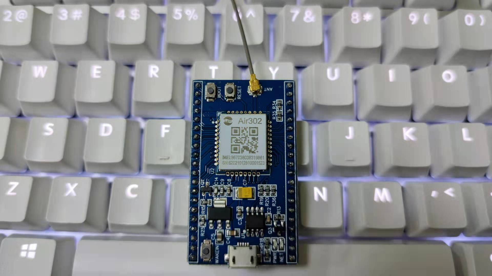

# [EC616](https://github.com/SoCXin/EC616)

* [eigencomm](http://www.eigencomm.com/)：[Cortex-M3](https://github.com/SoCXin/Cortex)
* [L5R4](https://github.com/SoCXin/Level)：204MHz, [2.46 CoreMark/MHz](https://www.eembc.org/coremark/scores.php)

## [简介](https://github.com/SoCXin/EC616/wiki)

[EC616](https://github.com/SoCXin/EC616)是上海移芯通信科技有限公司完全自主研发的超低成本、超低功耗和超高集成度NB-IoT SoC芯片，完全支持3GPP R13/R14 NB-IoT标准。EC616S单芯片集成射频收发机、PA、全部射频前端以及电源管理，极少的外围器件数量，可大幅降低下游客户BOM 成本。其支持2.2~4.5V宽电压输入，PSM休眠态电流低至0.8uA。

EC616S支持低功耗UART、模组BOM成本进一步降低、模组PCB面积进一步缩小，最小尺寸可以做到10mm×10mm。EC616S凭借其高集成、超低功耗和超宽工作电压范围等特点，成为NB-IoT 应用领域的理想选择，常被用于无线抄表、烟感、智慧路灯、智慧物流、资产追踪、智慧消防、智能停车、智能家居、可穿戴设备、工业及农业以及其它诸多行业。

### 关键特性

* NB-IoT:CAT-NB2、2-Harq、OTDOA
* TX 23dBm, RX -117dBm
* SPI×2，I2C×2，GPIO×26，USART×3，PWM×6，ADC×4，USIM×1
* 2.2 ~4.5V宽供电电压

### [资源收录](https://github.com/SoCXin)

* [参考资源](src/)
* [参考文档](docs/)
* [参考工程](project/)

### [选型建议](https://github.com/SoCXin)

[EC616](https://github.com/SoCXin/EC616) 相关竞品包括[MT2625](https://github.com/SoCXin/MT2625)，[XY1100](https://github.com/SoCXin/XY1100)等，基于AIR302模组和[LuatOS](https://github.com/openLuat/LuatOS)生态，具有更好更完整的openCPU开发基础。

* QFN52 (6mm*6mm*0.9mm)

#### 相关开发板

### [探索芯世界 www.SoC.xin](http://www.SoC.Xin)
